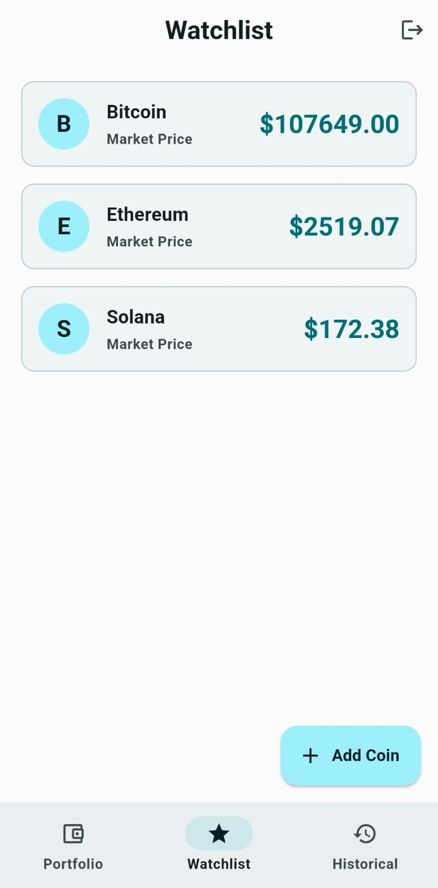
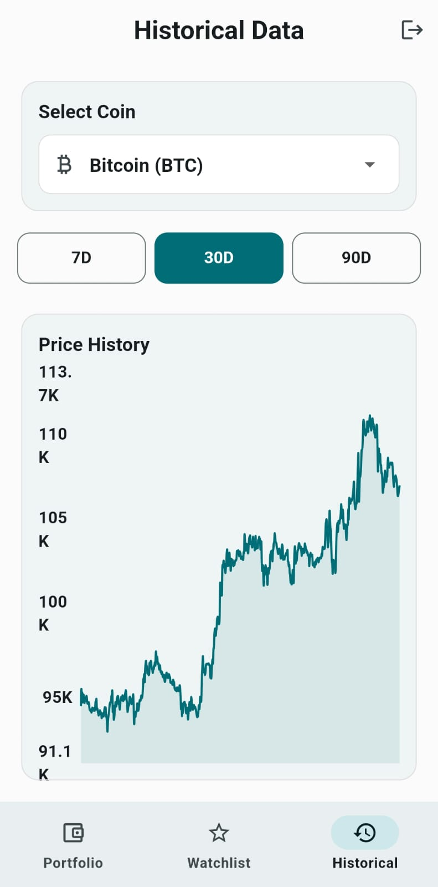

# 📱 CryptoPredictor – Flutter App

A mobile app built using Flutter and Firebase that lets users track their favorite cryptocurrencies. Includes login/signup, personal watchlist with CRUD, real-time price updates via CoinGecko API, and a clean Material Design interface.

---

## 🎥 Demo Video

<p align="center">
  <a href="https://youtu.be/7aAxwEEij-Q?si=544Os76Fod2MYPjj" target="_blank">
    
  </a>
</p>


> ▶️ Click the image above to watch a 2-minute demo of the app

---

## 📸 Screenshots

<p align="center">
  
  
  
</p>

---

## ✨ Features

- 🔐 Firebase login & registration
- 📊 Real-time crypto price updates using CoinGecko API
- ✅ Add/remove coins to/from your watchlist (CRUD via Firestore)
- 📲 Responsive UI with Material Design 3
- 🔁 Pull-to-refresh and swipe-to-delete support
- ⚠️ Error handling and network state feedback

---

## 🛠️ Tech Stack

- Flutter (Dart)
- Firebase Authentication
- Firebase Firestore
- CoinGecko API (HTTP)
- Provider (state management)
- Visual Studio Code / Android Studio

---

## 🧱 Folder Structure

```
lib/
├── main.dart
├── models/
│   └── coin_model.dart
├── screens/
│   ├── login_screen.dart
│   ├── home_screen.dart
│   └── watchlist_screen.dart
├── services/
│   ├── auth_service.dart
│   └── firestore_service.dart
├── providers/
│   ├── user_provider.dart
│   └── coin_provider.dart
├── widgets/
│   └── add_coin_dialog.dart
```

---

## 🚀 Getting Started

```bash
git clone https://github.com/Ali-Ahmed026/crypto-predictor.git
cd crypto-predictor
flutter pub get
flutter run
```

✅ Make sure you:
- Set up Firebase for your app
- Add `google-services.json` to `android/app/`
- Enable Authentication and Firestore in Firebase Console

---

## 📄 License

This project is for educational/demo purposes.

---

## 🙋‍♂️ Author

Made by Ali Ahmed Malik (01-134222-022) from BS(CS)-6C
